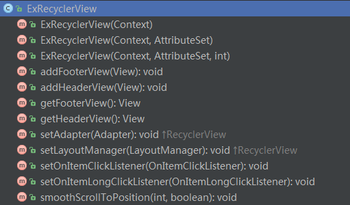
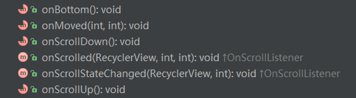

# ExRecyclerView  
--  
在`ExRecyclerView`中可以设置头、底、item点击监听等操作  
  

可利用`OnRecyclerViewScrollListener`监听滑动到顶部、底部的事件，还可以监听滑动的距离    
  

`ExStaggeredGridLayoutManager`的  
`setSpanSizeLookup(GridLayoutManager.SpanSizeLookup spanSizeLookup)`可以设置item是否跨列  

可利用`DividerGridItemDecoration`或`DividerItemDecoration`来添加分割线  

本项目中demo的adapter用的是通用的adapter（CommonRcvAdapter:[https://github.com/tianzhijiexian/CommonAdapter](https://github.com/tianzhijiexian/CommonAdapter)）来做的。可以方便简单的实现多个item类型的布局。

## 截图  
  
   
  

  

## 开发者
 

Jack Tony: <developer_kale@.com>  

## License

    Copyright 2015 Jack Tony

    Licensed under the Apache License, Version 2.0 (the "License");
    you may not use this file except in compliance with the License.
    You may obtain a copy of the License at

       http://www.apache.org/licenses/LICENSE-2.0

    Unless required by applicable law or agreed to in writing, software
    distributed under the License is distributed on an "AS IS" BASIS,
    WITHOUT WARRANTIES OR CONDITIONS OF ANY KIND, either express or implied.
    See the License for the specific language governing permissions and
    limitations under the License.

 